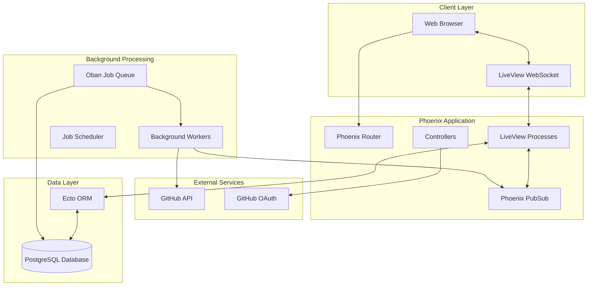
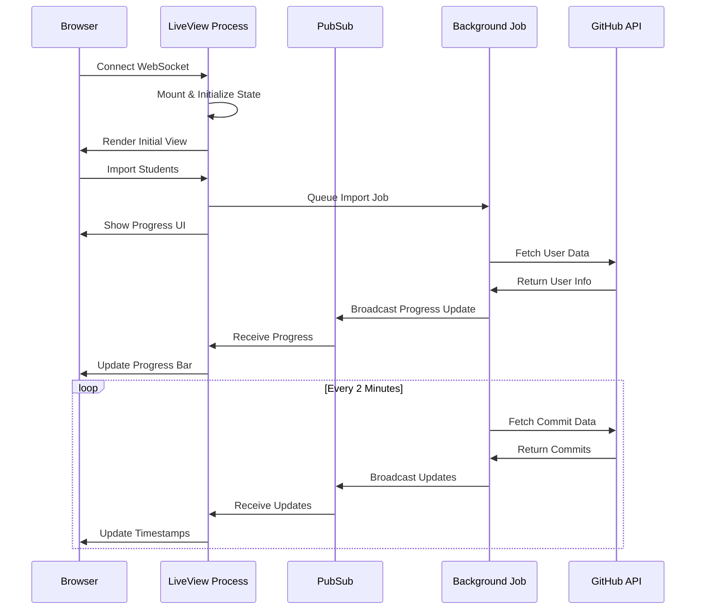

# Design Document

## Overview

The GitHub Classroom Manager is a real-time web application built with Phoenix LiveView that provides educators with live monitoring capabilities for student GitHub activity. The system leverages Phoenix's WebSocket-based LiveView technology to deliver real-time updates without page refreshes, combined with fault-tolerant background job processing using Oban for GitHub API interactions.

The architecture prioritizes real-time user experience, fault tolerance, and concurrent scalability to support 50+ simultaneous educators monitoring up to 105 students each. The system maintains persistent WebSocket connections for live updates while processing GitHub API calls asynchronously to prevent UI blocking.

## Architecture

### High-Level Architecture



### Real-Time Communication Flow



## Components and Interfaces

### LiveView Components

#### ClassLive (Main Dashboard)
**Purpose**: Primary interface for class management and real-time student monitoring

**State Management**:
- `@students` - List of class students with live data
- `@class` - Current class information
- `@connection_status` - WebSocket connection health
- `@last_refresh` - Timestamp of last data refresh
- `@auto_refresh_enabled` - Toggle for automatic updates

**Key Functions**:
- `mount/3` - Initialize class data and subscribe to PubSub topics
- `handle_info/2` - Process real-time updates from background jobs
- `handle_event/3` - Handle user interactions (add/remove students, manual refresh)
- `render/1` - Generate live dashboard HTML

**PubSub Subscriptions**:
- `"class:#{class_id}:students"` - Student data updates
- `"class:#{class_id}:commits"` - Commit activity updates
- `"system:connection"` - Connection status changes

#### ImportLive (Student Import Interface)
**Purpose**: Real-time student import with live validation and progress tracking

**State Management**:
- `@import_text` - Raw username input text
- `@parsed_usernames` - Validated username list
- `@import_progress` - Current import job progress
- `@import_results` - Real-time import results

**Key Functions**:
- `handle_event("validate", ...)` - Live username parsing and validation
- `handle_event("import", ...)` - Trigger background import job
- `handle_info({:import_progress, ...})` - Update progress bar
- `handle_info({:import_complete, ...})` - Show final results

#### StudentComponent (Individual Student Cards)
**Purpose**: Reusable component for displaying individual student information

**Props**:
- `student` - Student data struct
- `show_calendar` - Boolean for 5-day calendar display
- `live_updates` - Enable real-time timestamp updates

**Features**:
- Live timestamp formatting ("5 minutes ago" → "6 minutes ago")
- 5-day commit calendar with live dot updates
- Repository status indicators with live changes
- Direct links to GitHub profiles and repositories

#### CommitCalendarComponent (5-Day Activity Calendar)
**Purpose**: Visual representation of daily commit activity

**Props**:
- `commits` - List of commit data for 5 days
- `timezone` - User timezone for date calculations

**Rendering Logic**:
- `●` (filled dot) for days with commits
- `○` (empty dot) for days without commits
- Hover tooltips showing commit counts
- Automatic updates when commit data changes

### Background Job Workers

#### ImportStudentsJob
**Purpose**: Validate GitHub usernames and fetch user profile data

**Parameters**:
- `class_id` - Target class identifier
- `usernames` - List of GitHub usernames to import

**Process Flow**:
1. Validate each username format
2. Fetch GitHub user profile data via API
3. Check for `<username>.github.io` repository existence
4. Broadcast progress updates via PubSub
5. Store validated student records in database

**Error Handling**:
- Invalid usernames: Log and continue with others
- API rate limits: Implement exponential backoff
- Network failures: Retry with jitter

#### RefreshCommitsJob
**Purpose**: Update commit timestamps and activity data every 2 minutes

**Parameters**:
- `class_id` - Class to refresh
- `student_usernames` - Optional specific students to update

**Process Flow**:
1. Fetch latest commit data for each student's repositories
2. Calculate relative timestamps ("X minutes ago")
3. Update 5-day commit calendar data
4. Broadcast updates to subscribed LiveView processes
5. Schedule next refresh job

**Optimization**:
- Batch API requests where possible
- Use conditional requests with ETags
- Skip unchanged repositories

#### VerifyPagesReposJob
**Purpose**: Verify GitHub Pages repository existence and generate live site URLs

**Parameters**:
- `class_id` - Target class
- `student_username` - Specific student to verify

**Process Flow**:
1. Check for `<username>.github.io` repository
2. Verify repository is public and has content
3. Generate GitHub Pages site URL
4. Test site accessibility (optional)
5. Update student record with verification status

### Data Access Layer

#### Contexts

**Classroom Context** (`lib/gitclass/classroom.ex`):
- `create_class/2` - Create new class with validation
- `list_classes_for_teacher/1` - Get teacher's classes
- `add_student_to_class/3` - Add student with GitHub data
- `remove_student_from_class/2` - Remove student from class
- `get_class_with_students/1` - Load class with all student data

**GitHub Context** (`lib/gitclass/github.ex`):
- `fetch_user_profile/1` - Get GitHub user information
- `check_pages_repository/1` - Verify GitHub Pages repo
- `fetch_recent_commits/2` - Get commit activity data
- `get_commit_calendar/2` - Generate 5-day activity calendar

**Jobs Context** (`lib/gitclass/jobs.ex`):
- `import_students/2` - Queue student import job
- `schedule_commit_refresh/1` - Schedule periodic refresh
- `get_job_progress/1` - Check background job status

## Data Models

### Database Schema

```sql
-- Users table for teacher authentication
CREATE TABLE users (
    id UUID PRIMARY KEY DEFAULT gen_random_uuid(),
    github_id BIGINT UNIQUE NOT NULL,
    github_username VARCHAR(255) NOT NULL,
    name VARCHAR(255),
    avatar_url TEXT,
    email VARCHAR(255),
    inserted_at TIMESTAMP NOT NULL DEFAULT NOW(),
    updated_at TIMESTAMP NOT NULL DEFAULT NOW()
);

-- Classes managed by teachers
CREATE TABLE classes (
    id UUID PRIMARY KEY DEFAULT gen_random_uuid(),
    teacher_id UUID NOT NULL REFERENCES users(id) ON DELETE CASCADE,
    name VARCHAR(255) NOT NULL,
    term VARCHAR(100),
    inserted_at TIMESTAMP NOT NULL DEFAULT NOW(),
    updated_at TIMESTAMP NOT NULL DEFAULT NOW()
);

-- Students in each class with GitHub data
CREATE TABLE class_students (
    id UUID PRIMARY KEY DEFAULT gen_random_uuid(),
    class_id UUID NOT NULL REFERENCES classes(id) ON DELETE CASCADE,
    student_github_username VARCHAR(255) NOT NULL,
    student_name VARCHAR(255),
    student_avatar_url TEXT,
    has_pages_repo BOOLEAN DEFAULT FALSE,
    pages_repo_url TEXT,
    live_site_url TEXT,
    last_commit_at TIMESTAMP,
    verification_status VARCHAR(50) DEFAULT 'pending',
    added_at TIMESTAMP NOT NULL DEFAULT NOW(),
    updated_at TIMESTAMP NOT NULL DEFAULT NOW(),
    
    UNIQUE(class_id, student_github_username)
);

-- Commit activity tracking for calendar display
CREATE TABLE commit_activities (
    id UUID PRIMARY KEY DEFAULT gen_random_uuid(),
    class_id UUID NOT NULL REFERENCES classes(id) ON DELETE CASCADE,
    student_username VARCHAR(255) NOT NULL,
    commit_date DATE NOT NULL,
    commit_count INTEGER DEFAULT 0,
    last_commit_at TIMESTAMP,
    repository_name VARCHAR(255),
    updated_at TIMESTAMP NOT NULL DEFAULT NOW(),
    
    UNIQUE(class_id, student_username, commit_date, repository_name)
);

-- Background job tracking and progress
CREATE TABLE background_jobs (
    id UUID PRIMARY KEY DEFAULT gen_random_uuid(),
    class_id UUID REFERENCES classes(id) ON DELETE CASCADE,
    job_type VARCHAR(100) NOT NULL,
    status VARCHAR(50) DEFAULT 'queued',
    progress INTEGER DEFAULT 0,
    total INTEGER DEFAULT 0,
    error_message TEXT,
    started_at TIMESTAMP,
    completed_at TIMESTAMP,
    inserted_at TIMESTAMP NOT NULL DEFAULT NOW(),
    updated_at TIMESTAMP NOT NULL DEFAULT NOW()
);

-- Indexes for performance
CREATE INDEX idx_class_students_class_id ON class_students(class_id);
CREATE INDEX idx_commit_activities_class_student ON commit_activities(class_id, student_username);
CREATE INDEX idx_commit_activities_date ON commit_activities(commit_date);
CREATE INDEX idx_background_jobs_status ON background_jobs(status);
```

### Elixir Schemas

```elixir
# User schema for teacher authentication
defmodule Gitclass.Accounts.User do
  use Ecto.Schema
  import Ecto.Changeset

  @primary_key {:id, :binary_id, autogenerate: true}
  schema "users" do
    field :github_id, :integer
    field :github_username, :string
    field :name, :string
    field :avatar_url, :string
    field :email, :string
    
    has_many :classes, Gitclass.Classroom.Class, foreign_key: :teacher_id
    
    timestamps()
  end
end

# Class schema
defmodule Gitclass.Classroom.Class do
  use Ecto.Schema
  import Ecto.Changeset

  @primary_key {:id, :binary_id, autogenerate: true}
  schema "classes" do
    field :name, :string
    field :term, :string
    
    belongs_to :teacher, Gitclass.Accounts.User, type: :binary_id
    has_many :students, Gitclass.Classroom.ClassStudent
    has_many :commit_activities, Gitclass.Classroom.CommitActivity
    
    timestamps()
  end
end

# Student schema with GitHub integration
defmodule Gitclass.Classroom.ClassStudent do
  use Ecto.Schema
  import Ecto.Changeset

  @primary_key {:id, :binary_id, autogenerate: true}
  schema "class_students" do
    field :student_github_username, :string
    field :student_name, :string
    field :student_avatar_url, :string
    field :has_pages_repo, :boolean, default: false
    field :pages_repo_url, :string
    field :live_site_url, :string
    field :last_commit_at, :utc_datetime
    field :verification_status, :string, default: "pending"
    field :added_at, :utc_datetime
    
    belongs_to :class, Gitclass.Classroom.Class, type: :binary_id
    
    timestamps()
  end
end
```

## Error Handling

### LiveView Error Recovery

**Connection Loss Handling**:
- Automatic reconnection with exponential backoff
- State restoration from server-side assigns
- User notification of connection status
- Graceful degradation during offline periods

**Process Crash Recovery**:
- LiveView process supervision and restart
- State persistence in database for critical data
- User session recovery without data loss
- Error logging and monitoring

### Background Job Error Handling

**GitHub API Failures**:
- Exponential backoff with jitter for rate limits
- Retry logic for transient network errors
- Graceful handling of invalid usernames
- Partial success processing (continue with valid users)

**Database Transaction Failures**:
- Atomic operations for data consistency
- Rollback handling for failed imports
- Conflict resolution for concurrent updates
- Data integrity validation

### User Experience Error Handling

**Validation Errors**:
- Real-time form validation with clear messages
- Progressive enhancement for JavaScript-disabled browsers
- Accessible error messaging
- Recovery suggestions for common issues

**Performance Degradation**:
- Loading indicators for long-running operations
- Timeout handling with user feedback
- Fallback to manual refresh options
- Resource usage monitoring and alerts

## Testing Strategy

### Unit Testing

**LiveView Testing**:
- Mount and render testing for all LiveView modules
- Event handling verification
- State management validation
- PubSub message handling tests

**Context Testing**:
- Database operation testing with ExUnit
- GitHub API integration testing with mocks
- Business logic validation
- Error condition testing

### Integration Testing

**End-to-End Workflows**:
- Complete student import process testing
- Real-time update propagation verification
- Multi-user concurrent access testing
- Background job processing validation

**External Service Integration**:
- GitHub API integration testing with VCR
- OAuth flow testing
- Rate limit handling verification
- Network failure simulation

### Performance Testing

**Load Testing**:
- Concurrent user simulation (50+ teachers)
- WebSocket connection stress testing
- Database query performance validation
- Memory usage monitoring under load

**Real-Time Performance**:
- Update latency measurement (< 5 seconds target)
- Background job processing speed validation
- PubSub message delivery verification
- Connection recovery time testing

### Browser Testing

**Cross-Browser Compatibility**:
- WebSocket support verification
- JavaScript functionality testing
- Responsive design validation
- Accessibility compliance testing

**Progressive Enhancement**:
- Functionality without JavaScript
- Graceful degradation testing
- Mobile device compatibility
- Screen reader compatibility